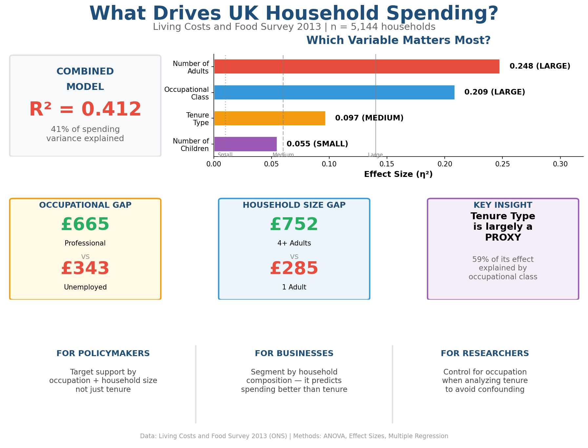
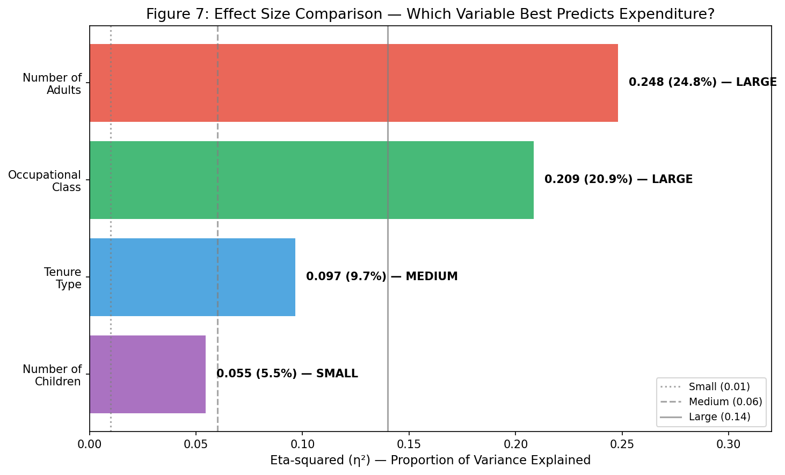
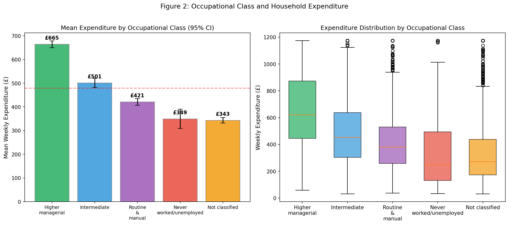
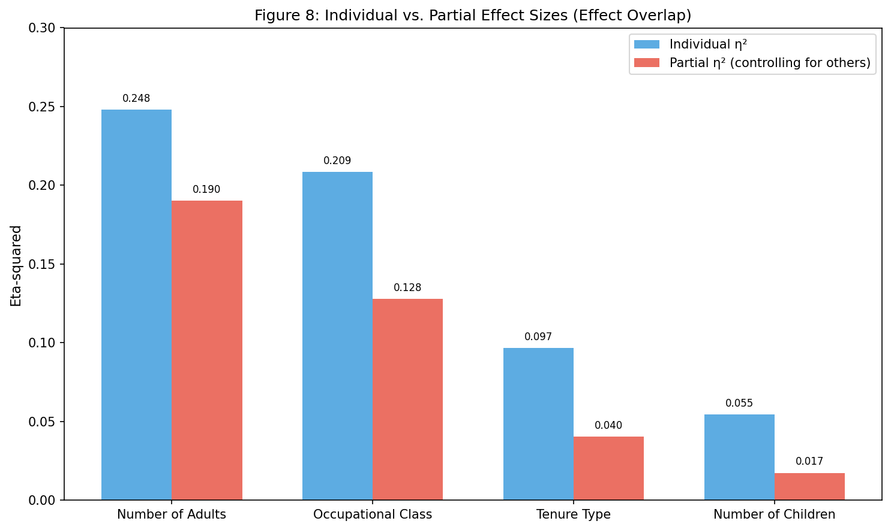

# 🏠 What Drives UK Household Spending?

<p align="center">
  
</p>

<p align="center">
  <a href="#-key-findings">Key Findings</a> •
  <a href="#-quick-start">Quick Start</a> •
  <a href="#-methodology">Methodology</a> •
  <a href="#-results">Results</a> •
  <a href="#-interactive-dashboard">Dashboard</a>
</p>

<p align="center">
  
  
  
  
  
</p>

---

## 📌 TL;DR

> **Research Question:** Do occupational class, tenure type, number of adults, and number of children predict household spending?
>
> **Answer:** Yes. These four factors explain **41% of spending variation**. Household size matters most — professionals spend **2x more** than unemployed households.

---

## 🎯 Key Findings

<table>
<tr>
<td width="50%">

### 📊 Effect Sizes

| Variable | η² | Effect |
|:---------|:--:|:------:|
| Number of Adults | **0.248** | 🔴 Large |
| Occupational Class | **0.209** | 🔴 Large |
| Tenure Type | 0.097 | 🟡 Medium |
| Number of Children | 0.055 | 🟢 Small |

</td>
<td width="50%">

### 💰 Spending Gaps

| Comparison | Gap |
|:-----------|----:|
| Professional vs Unemployed | **£322/week** |
| 4+ Adults vs 1 Adult | **£467/week** |
| Owned vs Public Rented | **£246/week** |
| 2+ Children vs None | **£168/week** |

</td>
</tr>
</table>

### 🔑 The Big Insight

**Tenure type is mostly a proxy for occupational class.** When we control for occupation, tenure's effect drops by 59%. Homeowners spend more not because they own, but because higher earners are more likely to own.

---

## 🚀 Quick Start

```bash
# Clone the repository
git clone https://github.com/yourusername/uk-household-expenditure-analysis.git
cd uk-household-expenditure-analysis

# Create virtual environment
python -m venv venv
source venv/bin/activate  # On Windows: venv\Scripts\activate

# Install dependencies
pip install -r requirements.txt

# Run the analysis
python code/complete_analysis.py

# Launch interactive dashboard
streamlit run dashboard/app.py
```

---

## 📁 Project Structure

```
uk-household-expenditure-analysis/
│
├── 📄 README.md                          # You are here
├── 📄 requirements.txt                   # Dependencies
├── 📄 LICENSE                            # MIT License
│
├── 📊 report/
│   ├── UK_Household_Expenditure_Analysis.pdf    # Full report
│   └── Executive_Summary.pdf                     # 1-page summary
│
├── 💻 code/
│   ├── complete_analysis.py              # Main analysis script
│   ├── analysis_notebook.ipynb           # Jupyter notebook with narrative
│   └── utils/
│       ├── data_processing.py            # Data cleaning functions
│       ├── statistical_tests.py          # ANOVA, post-hoc functions
│       └── visualization.py              # Plotting functions
│
├── 📈 figures/
│   ├── fig01_expenditure_distribution.png
│   ├── fig02_occupational_class.png
│   ├── fig03_tenure_type.png
│   ├── fig04_number_of_adults.png
│   ├── fig05_number_of_children.png
│   ├── fig06_all_variables_comparison.png
│   ├── fig07_effect_size_comparison.png
│   ├── fig08_effect_overlap.png
│   └── visual_summary.png
│
├── 🖥️ dashboard/
│   └── app.py                            # Streamlit interactive dashboard
│
└── 📂 data/
    └── README.md                         # Data access instructions
```

---

## 🔬 Methodology

### Analysis Pipeline

```
┌─────────────┐    ┌─────────────┐    ┌─────────────┐    ┌─────────────┐
│   Data      │───▶│  Individual │───▶│  Combined   │───▶│   Business  │
│   Cleaning  │    │   ANOVA     │    │    Model    │    │   Insights  │
└─────────────┘    └─────────────┘    └─────────────┘    └─────────────┘
      │                  │                  │                  │
      ▼                  ▼                  ▼                  ▼
 • Remove duplicates  • F-statistics    • R² = 0.412      • Policy recs
 • Encode categories  • Effect sizes    • Partial η²      • Business apps
 • Verify quality     • Post-hoc tests  • Overlap analysis
```

### Statistical Approach

| Step | Method | Purpose |
|:-----|:-------|:--------|
| 1 | Descriptive Statistics | Understand distributions |
| 2 | One-way ANOVA | Test group mean differences |
| 3 | Welch's ANOVA | Robustness check (unequal variances) |
| 4 | Kruskal-Wallis | Robustness check (non-parametric) |
| 5 | Tukey HSD | Pairwise comparisons |
| 6 | Effect Size (η²) | Practical significance |
| 7 | Multiple Regression | Combined model, partial effects |
| 8 | ML Validation | Feature importance confirmation |

### Assumptions Handling

| Assumption | Status | Solution |
|:-----------|:------:|:---------|
| Independence | ✅ Met | Random sampling design |
| Normality | ⚠️ Violated | Large n + CLT + Kruskal-Wallis check |
| Homogeneity | ⚠️ Violated | Welch's ANOVA (robust) |

---

## 📊 Results

### Effect Size Comparison

<p align="center">
  
</p>

### Spending by Occupational Class

<p align="center">
  
</p>

### Effect Overlap (Individual vs Partial)

<p align="center">
  
</p>

> 💡 **Key insight:** Tenure type's effect drops 59% when controlling for occupation — it's largely a proxy variable.

---

## 🖥️ Interactive Dashboard

Explore the data yourself with our Streamlit dashboard:

```bash
streamlit run dashboard/app.py
```

**Features:**
- 🔍 Filter by demographic groups
- 📊 Compare spending distributions
- 📈 View statistical test results
- 💾 Export custom analyses

---

## 📋 Key Statistics

```
┌────────────────────────────────────────────────────────────────┐
│                    ANOVA RESULTS SUMMARY                       │
├────────────────────┬──────────┬──────────┬────────┬───────────┤
│ Variable           │ F-stat   │ p-value  │ η²     │ Effect    │
├────────────────────┼──────────┼──────────┼────────┼───────────┤
│ Number of Adults   │ 565.28   │ < 0.001  │ 0.248  │ Large     │
│ Occupational Class │ 338.51   │ < 0.001  │ 0.209  │ Large     │
│ Tenure Type        │ 275.23   │ < 0.001  │ 0.097  │ Medium    │
│ Number of Children │ 148.59   │ < 0.001  │ 0.055  │ Small     │
└────────────────────┴──────────┴──────────┴────────┴───────────┘

Combined Model: R² = 0.412 (41.2% variance explained)
```

---

## 💼 Business Applications

<table>
<tr>
<td width="33%">

### 🏛️ Policy

- Target support by occupation + household size
- Adjust benefits per-capita
- Don't over-rely on tenure for eligibility

</td>
<td width="33%">

### 🏪 Retail

- Segment by household composition
- Premium targeting: professional + multi-adult
- Location planning using demographics

</td>
<td width="33%">

### 🏦 Finance

- Credit scoring: occupation > tenure
- Product targeting by household type
- Risk assessment refinement

</td>
</tr>
</table>

---

## 👥 Team

| Name | Contribution |
|:-----|:-------------|
| Borja Ferrer Pons | Project coordination |
| **MD Noornabi** | Variables, categories, analysis method, combined model |
| Hilal Chanekar | Assumptions, hypotheses, results analysis |
| Marc Zanón Pons | Data cleaning, ML validation |
| Simão Ponte | Documentation, review |

---

## 📚 Data Source

**Dataset:** Living Costs and Food Survey (LCF) 2013  
**Provider:** Office for National Statistics  
**Access:** [UK Data Service](https://ukdataservice.ac.uk/) (registration required)

> ⚠️ Dataset not included due to licensing. See [data/README.md](data/README.md) for access instructions.

---

## 🛠️ Tech Stack

<p align="center">
  
  
  
  
  
  
  
</p>

---

## 📖 Citation

```bibtex
@misc{uk_expenditure_2026,
  author = {Ferrer Pons, Borja and Noornabi, MD and Chanekar, Hilal and Zanón Pons, Marc and Ponte, Simão},
  title = {What Drives UK Household Spending? An Analysis Using the Living Costs and Food Survey},
  year = {2026},
  publisher = {GitHub},
  url = {https://github.com/cracker-MDN/uk-household-expenditure-analysis}
}
```

---

## 📄 License

This project is licensed under the MIT License - see the [LICENSE](LICENSE) file for details.

---

<p align="center">
  <i>Mayerfeld Data Analysis Practicum | February 2026</i>
</p>

<p align="center">
  <a href="#-what-drives-uk-household-spending">Back to top ↑</a>
</p>
